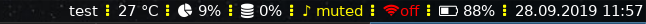

## rstatus - bar for tiling wms(i3, sway, etc)

### Building
* cargo build --release

### Running 
* copy one of sample configs to actual config e.g.
**mkdir -p ~/.config/rstatus**
**cp samples/simple.yaml ~/.config/rstauts/config.yaml**
**./rstatus**
* if everything goes ok you could paste rstatus command to config  
of your tiling wm

### Usage dependencies
* volume block requires amixer(alsa-utils package)

### Sample screenshots
 
 
 

### Default Block options
* interval - update interval in seconds
* signal - signal for update block
* name - block name
* retry - retry update block  in seconds
* separator_width -  width of separator after block
* custom_separator -  use custom symbol(s) for block separator
* color - foreground color ('#RRGGBB')
* bgcolor - background color ('#RRGGBB')
* prefix - prefix of value
* prefix_color - color of prefix if any
* suffix - suffix of value
* suffix_color - color of suffix
* invalid - string displayed if value is invalid. if invalid value is displayed, prefix and suffix are ignored.
* invalid_color - color of invalid value (red is default)
* threshold_fix - if set to true, suffix and prefix changing colors accorgind to thresholds values
* thresholds - change color of value depending on thresholds

### Extending rstatus via custom block
See one of samples for syntax.  
it asks from your binary/shell scripts for output  
First line is for value, second is for color(optional)

